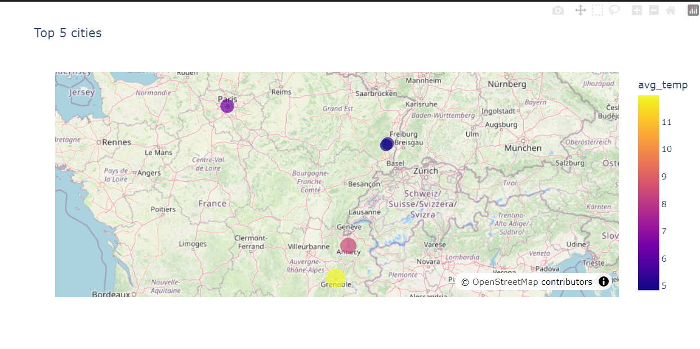
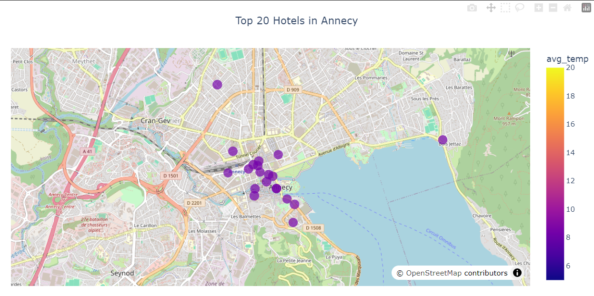
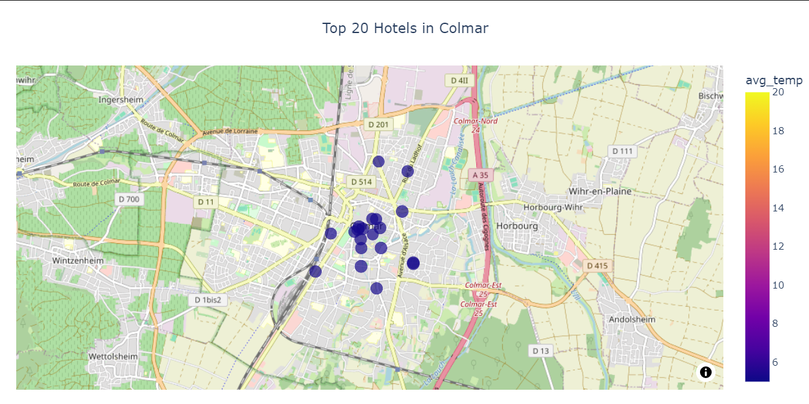
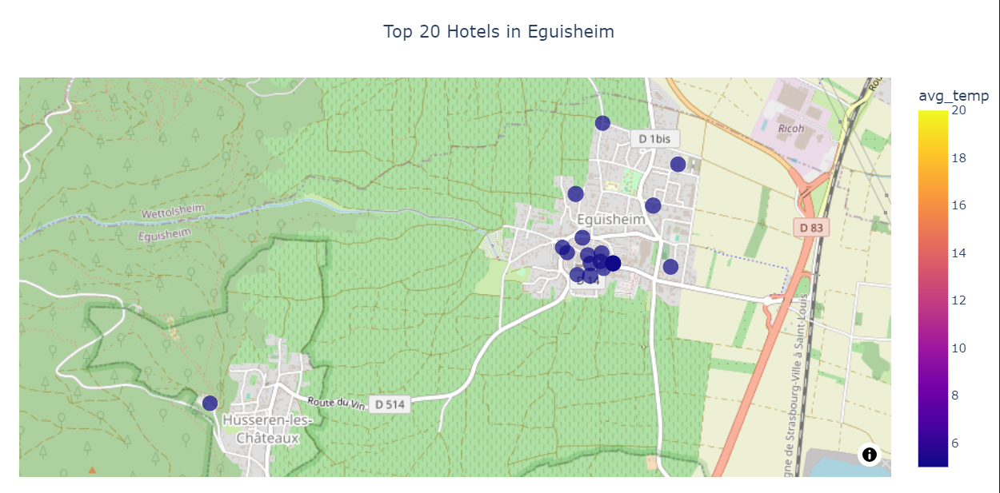
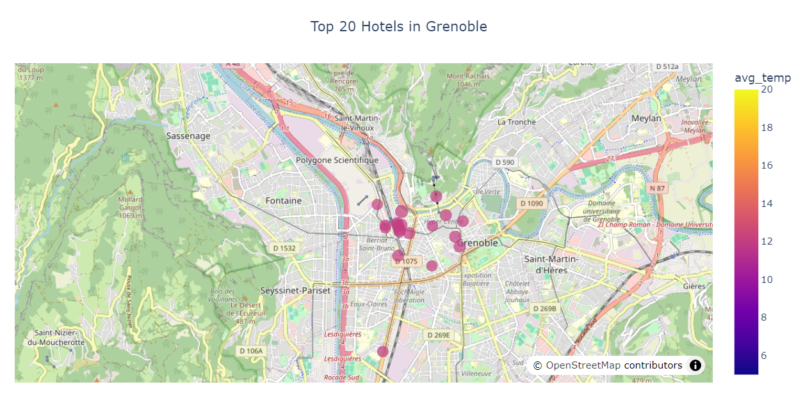
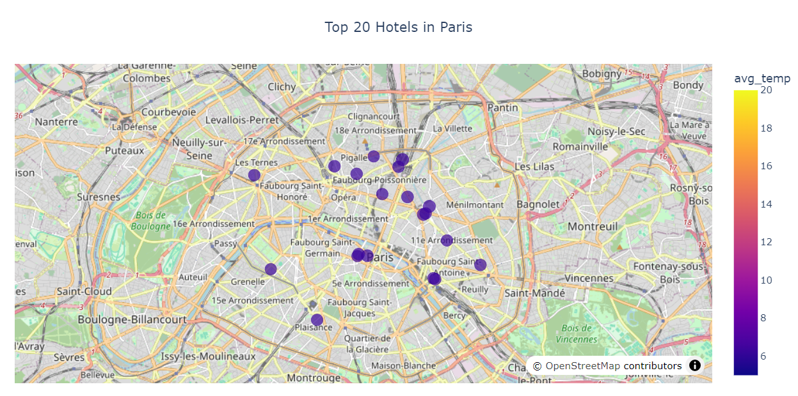

# Kayak Travel Recommendation Project 🚀

---

## 🎯 Project Goals

Since no data is currently available for this project, the primary tasks include:
1. **Scrape destination data**
2. **Collect weather data** for each destination
3. **Retrieve hotel information** for each destination
4. **Store all collected data** in a **data lake** (AWS S3)
5. **ETL (Extract, Transform, Load) process** to clean and load data into a **SQL Data Warehouse** (AWS RDS)

The purpose of this project is to find the cities where the weather is nice in the next 7 days, helping travelers make informed decisions about their trips.

---

## 🖼️ Scope of the Project

For the initial phase, the focus is on **France**, specifically the **top 35 cities** to visit according to **One Week In.com**:

```
["Mont Saint Michel", "St Malo", "Bayeux", "Le Havre", "Rouen", "Paris", "Amiens", "Lille", 
"Strasbourg", "Chateau du Haut Koenigsbourg", "Colmar", "Eguisheim", "Besancon", "Dijon", 
"Annecy", "Grenoble", "Lyon", "Gorges du Verdon", "Bormes les Mimosas", "Cassis", "Marseille", 
"Aix en Provence", "Avignon", "Uzes", "Nimes", "Aigues Mortes", "Saintes Maries de la mer", 
"Collioure", "Carcassonne", "Ariege", "Toulouse", "Montauban", "Biarritz", "Bayonne", "La Rochelle"]
```

The application will focus **only on these cities** for recommendations.

---

## 🦮 Helpers & Guidelines

### 🔹 Get Weather Data (API)
- Use **[Nominatim API](https://nominatim.org/release-docs/develop/api/Search/)** to get GPS coordinates of cities.
- Use **[OpenWeather API](https://openweathermap.org/api/one-call-api)** to retrieve weather data (requires a free API key).

### 🔹 Scrape Hotel Data (Booking.com)
- Since **Booking Holdings** does not provide an aggregated database, data needs to be scraped.
- Suggested data to collect:
  - **Hotel Name**
  - **URL to Booking.com page**
  - **Latitude & Longitude**
  - **Ratings**
  - **Hotel Description**

### 🔹 Store Data in a Data Lake (AWS S3)
- Store the collected **weather and hotel data** as a CSV file in **AWS S3**.

### 🔹 ETL & SQL Data Warehouse (AWS RDS)
- Extract data from **AWS S3**, clean it, and load it into an **SQL Database** (AWS RDS) for easier analysis.

### 🔹 Visualize Data
- Use **Plotly** (or other visualization libraries) to create interactive maps:
  - **Top-5 recommended destinations** based on weather and hotel ratings.

  
  - **Top-20 best hotels** in the selected areas.





---

## 📬 Deliverables

1. **A CSV file** in **AWS S3** containing enriched data (weather + hotel details) for the 35 French cities.
2. **A SQL Database** (AWS RDS) containing cleaned data extracted from S3.
3. **Two interactive maps**:
   - **Top-5 recommended travel destinations**
   - **Top-20 best hotels**

---

## ⚙️ Tech Stack
- **Python** (Scraping, Data Processing, API Calls)
- **Scrapy** (Web Scraping)
- **OpenWeather API & Nominatim API** (Weather & Geolocation)
- **AWS S3** (Data Lake)
- **AWS RDS (PostgreSQL)** (Data Warehouse)
- **Pandas & NumPy** (Data Manipulation)
- **Plotly/Matplotlib** (Visualization)

---

## 📌 Future developpement 
- Implement data collection scripts (scraping & API calls)
- Store data in **AWS S3**
- Build **ETL pipeline** to clean and move data to **AWS RDS**
- Develop visualization dashboards for **destination & hotel recommendations**
- Deploy the final **recommendation system**

